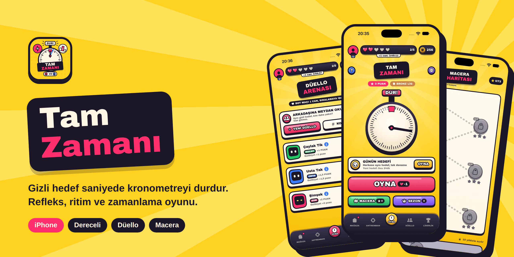
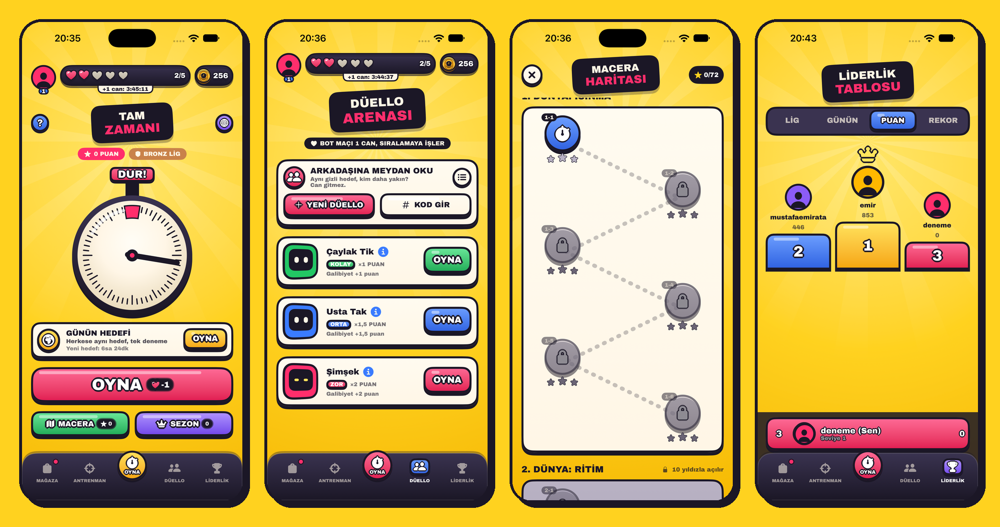
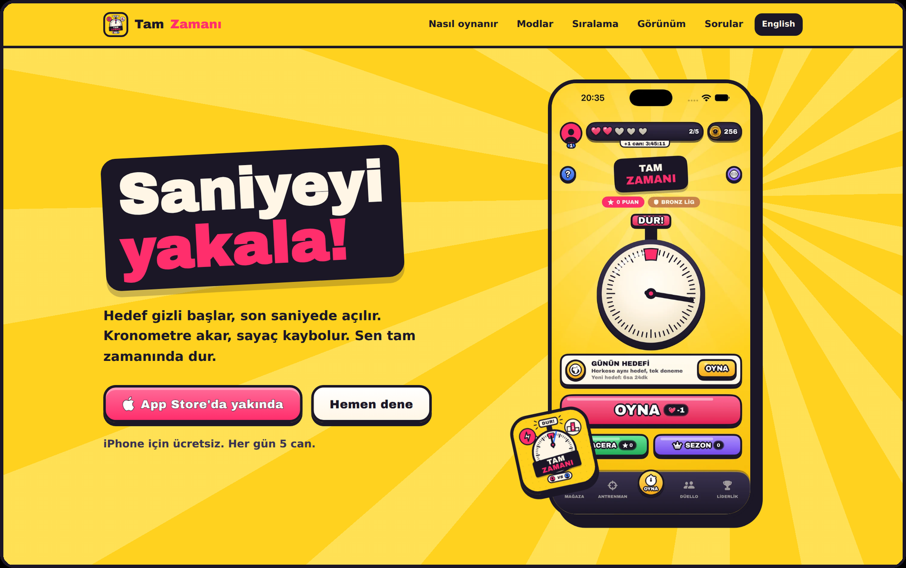
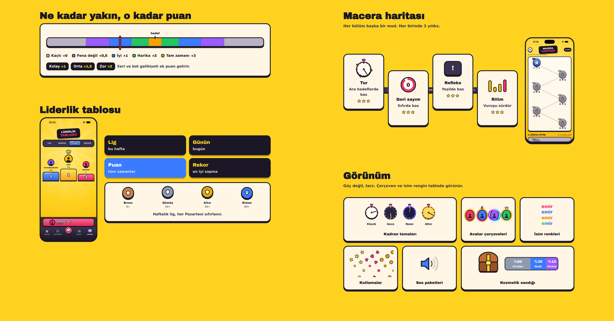
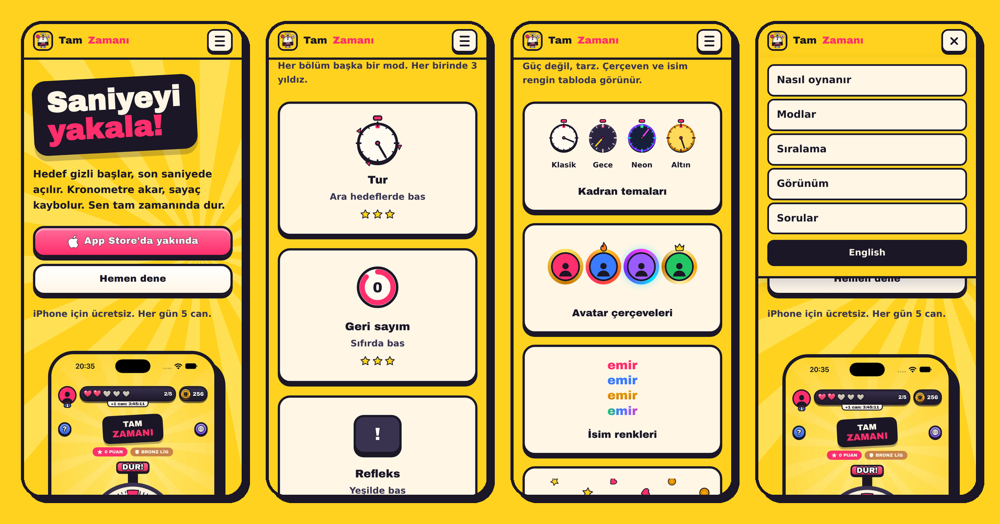

  

<h1 align="center">Tam Zamanı</h1>

  <b>Gizli hedef saniyede kronometreyi durdur.</b> 
  Refleks, ritim ve zamanlama üzerine kurulu bir iPhone oyunu ve tanıtım sitesi.

  <a href="https://tamzamani.mustafaemirata.net.tr"><b>Siteyi aç</b></a>
  &nbsp;&nbsp;|&nbsp;&nbsp;
  <a href="https://tamzamani.mustafaemirata.net.tr/en">English</a>
  &nbsp;&nbsp;|&nbsp;&nbsp;
  <a href="https://tamzamani.mustafaemirata.net.tr/iletisim">İletişim</a>

---

## Oyun hakkında

Kronometre döner, hedef saniye gizlidir. Son anda ortaya çıkar ve ibreyi tam zamanında durdurman gerekir. Ne kadar yaklaşırsan o kadar çok puan alırsın.

- **Dereceli maçlar:** Bronzdan Elmasa uzanan lig sistemi ve haftalık sıralama
- **Botlara karşı:** Çaylak Tik, Usta Tak, Şimşek ve daha fazlası
- **Arkadaş düellosu:** Kod ya da bağlantıyla aynı hedefte kapışma
- **Macera haritası:** Tur, geri sayım, refleks ve ritim durakları
- **Günün hedefi:** Herkese aynı hedef, tek deneme
- **Görünümler ve sezon:** Kadran temaları, çerçeveler, sandıklar, sezon yolu ve başarımlar

## Uygulamadan ekranlar

  

## Site

  

Tarayıcıda denenebilen bir tur, animasyonlu puan göstergesi, macera yolu, liderlik tablosu, görünüm vitrini ve sık sorulan sorular tek sayfada.

  

### Mobil

Hamburger menü ve tek sütunlu düzen ile telefonlarda rahat okunur.

  

## Sayfalar

| Yol | İçerik |
| --- | --- |
| `/` | Türkçe tanıtım sayfası |
| `/en` | İngilizce tanıtım sayfası |
| `/gizlilik` | Gizlilik politikası |
| `/kvkk` | KVKK aydınlatma metni |
| `/destek` | Destek ve sık sorulan sorular |
| `/iletisim` | İletişim formu |
| `/duello` | Düello davet bağlantısı |

  © 2026 Mustafa Emir Ata

